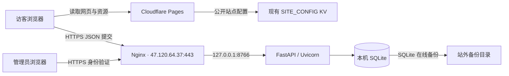

# 自建预约与反馈后端方案

日期：2026-09-20

分支：`feat/self-hosted-booking-backend`

状态：首版已在本分支实现，设计依据保留如下。实际接口、测试方式、服务器部署与当前接收状态以 [后端部署与验收记录](backend.md) 为准。

## 1. 目标与首版决定

访客在 `geekbird.org` 内填写预约和反馈，数据由极客鸟自己的服务器接收与保存。首页、服务页、免责声明及两个表单页继续部署在 Cloudflare Pages。

首版采用：**站内静态表单 + HTTPS JSON API + Python FastAPI + SQLite + Nginx/systemd**。服务器暂用 `47.120.64.37`，通过 `root` 和现有 SSH key 部署，应用使用专用低权限用户运行。

预约的含义是“提交服务申请”。提交成功后由志愿者联系、确认安排，不承诺立即分配维修时段。反馈继续承担服务评价与志愿时长核对的作用。

首版交付范围：

- 站内预约页 `/booking/`、反馈页 `/feedback/`，表单校验、提交回执与失败重试。
- 预约与反馈数据库，防止同一次提交因重试产生重复记录。
- 管理员查看、筛选记录，维护预约状态、内部备注、反馈核实结果和确认时长，导出 CSV。
- 服务端接收开关、请求限流、管理员身份验证、数据库备份及恢复流程。
- 旧配置迁移、测试环境、分阶段上线和回滚。

后续再做用户账号、在线排班、志愿者个人账号、自动通知和故障照片上传。第一版提交成功后由管理员在后台查看并跟进处理；不会自动发送 QQ、短信或邮件。

## 2. 现状与已核实条件

| 项目 | 2026-09-20 核查结果 | 对方案的影响 |
| --- | --- | --- |
| 正式前端 | `https://geekbird.org/`，Cloudflare Pages | 沿用静态部署与现有视觉样式 |
| 预约、反馈 | 当前分别指向问卷星 `93277562`、`93298004` | 需要自建表单与提交接口 |
| 配置 | `config.js` 默认值；Pages Worker 从 `SITE_CONFIG` KV 读取已保存配置 | 仅改源码默认链接不能保证切换成功 |
| 旧站内预约页 | `/booking/` 是兼容入口，没有表单 | 改为实际预约页，新增反馈页 |
| 链接校验 | `assets/app.js`、`cloudflare/worker.js`、`server/admin.py` 拒绝站内链接；构建检查拒绝表单 | 这些规则与测试必须一起迁移 |
| 服务器 | Debian、Python 3.11.2、SQLite 3.40.1，磁盘可用约 35 GB | 足够支撑首版，无需另起数据库服务器 |
| 现有服务 | Nginx；`geekbird-admin` 监听 `127.0.0.1:8765` | 新业务 API 独立监听 `127.0.0.1:8766` |
| HTTPS | `https://47.120.64.37/` 可通过证书验证并返回 200 | 可以先直接使用 HTTPS IP 接口 |
| 证书续期 | Let's Encrypt IP 短期证书；现有定时器每 6 小时检查续期 | 上线验收必须包括续期验证路径和证书监测 |

核查时 IP 证书到期时间为 **2026-09-26 03:19 UTC**；这是当时证书的状态，实际有效期以服务器为准。保留当前 80 端口的 ACME 验证路径及 `geekbird-cert-renew.timer`。

已读取[旧预约问卷](https://www.wjx.top/m/93277562.aspx)和[旧反馈问卷](https://www.wjx.top/m/93298004.aspx)的公开题目，没有读取或导出任何历史答卷。历史答卷不会因部署新后端自动迁移。现有部署依据见 [Cloudflare 说明](cloudflare.md)与 [VPS 记录](vps.md)。

## 3. 架构与访问路径



图中的“站外备份目录”指公开网站目录之外，仍位于同一台服务器；另存异机副本才能覆盖整机丢失，见第 10 节。

| 地址或路径 | 承载位置 | 用途 |
| --- | --- | --- |
| `https://geekbird.org/booking/` | Cloudflare Pages | 预约表单 |
| `https://geekbird.org/feedback/` | Cloudflare Pages | 反馈表单 |
| `https://geekbird.org/_gb-settings/` | 现有 Pages Worker | 联系 QQ 与管理入口 |
| `https://47.120.64.37/api/v1/…` | VPS | 表单提交和接收状态 |
| `https://47.120.64.37/_gb-data/` | VPS | 新预约、反馈管理页 |
| `https://47.120.64.37/_gb-data/api/…` | VPS | 需登录的记录管理接口 |

公开表单在浏览器中直接调用 VPS。第一版不增加 Cloudflare 转发层，预约内容不写入 KV、D1 或 Pages Worker。现有 Worker 继续负责公开配置及设置页。

前端使用公开配置 `apiBaseUrl`，生产初始值为 `https://47.120.64.37/api/v1`。地址属于公开信息，不能把管理员密码、SSH key 或其他密钥放入前端配置。

后续为服务器绑定 `api.geekbird.org`、配置域名证书并验证接口后，再更新 `apiBaseUrl`。旧 IP 接口保留一段兼容期。正式迁移时以 HTTPS 返回的最终接口为目标，避免对预检请求和 POST 依赖跨域重定向。

### 为什么采用这组技术

- **FastAPI + Uvicorn**：Python 环境已经存在，框架能集中处理字段校验、错误格式及路由。新业务服务独立于现有标准库配置服务，避免把两类逻辑混在一个文件里。锁定依赖版本，使用独立虚拟环境。
- **SQLite**：单台服务器、人工跟进、短事务的预约业务适合先用 SQLite；部署与备份简单。首版采用标准库 `sqlite3` 与版本化 SQL 迁移，每次请求使用独立连接，通过同步路由执行数据库操作。使用 WAL、外键和数据库迁移管理。数据库文件只能保存在本地磁盘。
- **Nginx + systemd**：沿用现有 HTTPS 入口，应用只监听回环地址。首版单 Uvicorn worker，保持事务短小；出现持续写入锁等待、需要多实例或复杂报表时再评估 PostgreSQL。

这是一版可运行的单机方案，不提供服务器故障时自动切换。API 故障期间静态官网仍可访问，表单明确提示失败并保留用户输入。

## 4. 页面与业务流程

### 4.1 预约

`首页 / 服务页 → /booking/ → 填写申请 → 收到预约编号 → 志愿者联系 → 确认安排 → 处理与结案`

页面说明“提交后等待联系，具体安排以双方确认为准”。只有数据库事务成功提交后才显示成功和预约编号。等待期间禁用提交按钮；超时不清空表单，也不显示虚假的成功提示。

依据旧预约问卷制定以下字段。相比原表，将 QQ 与邮箱拆分，手机与 QQ 改为至少填写一个，减少重复索取联系方式。

| 字段 | 规则 | 与原表的关系 |
| --- | --- | --- |
| 姓名 `name` | 必填，1–40 字符 | 保留 |
| 年级和专业 `gradeMajor` | 必填，1–100 字符 | 保留合并字段，首版不建设院系字典 |
| 手机 `phone` | 与 QQ 至少填一个；首版校验大陆 11 位手机号 | 保留，调整必填条件 |
| QQ `qq` | 与手机至少填一个；5–15 位数字，不以 0 开头 | 从旧混合字段拆出 |
| 邮箱 `email` | 选填，有效邮箱，最长 254 字符 | 合并原表重复的邮箱收集项 |
| 电脑品牌与型号 `device` | 必填，1–120 字符 | 保留 |
| 系统版本 `os` | 必填，1–100 字符，可填“不清楚” | 从设备描述拆出 |
| 故障描述 `issue` | 必填，5–4000 字符 | 保留；提示说明现象、出现时间、是否有重要资料未备份 |
| 方便联系的时间 `preferredContactTime` | 选填，最长 200 字符 | 新增；只是联系偏好，不表示已预约成功 |
| 阅读与信息使用确认 `consent` | 必须为 `true`；记录说明版本与服务端时间 | 引用站内最新免责声明和信息用途说明 |

预约、反馈都同时提交 `consentVersion`，表示用户实际阅读的说明版本。页面展示对应版本的说明；若服务端要求的版本已变更，提示重新阅读确认，不把旧确认直接记为新版本。

旧表的照片上传放到后续扩展阶段，需要同时处理体积限制、真实文件类型、图片元数据、私有存储和下载鉴权。首版不显示无法使用的上传按钮，必要图片在志愿者联系后提供。

旧问卷中的笼统免责文案不直接照搬。沿用本站现有原则：提交预约不等于授权重装、格式化或拆机；具体操作仍需另行沟通确认。

### 4.2 反馈与志愿时长

旧反馈问卷包含人员、服务内容、服务时长和三个维度的评分。新表保留这些信息，不简化为单一评分或普通留言。

| 字段 | 规则 | 用途 |
| --- | --- | --- |
| 姓名与专业 `nameMajor` | 必填，1–100 字符 | 延续原表身份核对方式 |
| 联系方式 `contactType` / `contact` | 必填，QQ 或手机；按所选类型校验 | 需要核实时联系 |
| 预约编号 `bookingReference` | 选填，最长 64 字符 | 关联新系统预约；历史服务、产品导购也可反馈 |
| 服务内容 `serviceTypes` | 必填、多选：`repair` 日常预约、`purchase_advice` 产品导购 | 对应原表两个选项 |
| 故障或咨询简述 `summary` | 必填，1–2000 字符 | 保留 |
| 志愿者姓名 `volunteerNames` | 必填，1–200 字符；多人用顿号分隔 | 首版按文本记录，后台核实 |
| 用户填报时长 `reportedHours` | 必填，大于 0、不超过 5 小时，最多两位小数 | 保留原表 5 小时上限；如 `2.5` |
| 提交预约或咨询日期 `requestedOn` | 必填，`YYYY-MM-DD`，不得晚于北京时间当天 | 保留；不预填当前日期造成误报 |
| 服务态度、技术、综合体验 | `attitudeRating`、`skillRating`、`overallRating`，各为 1–5 的整数 | 保留三个评分维度 |
| 给志愿者的评语 `comment` | 选填，最长 2000 字符 | 保留 |
| 信息使用确认 `consent` | 必须为 `true`；记录说明版本与服务端时间 | 告知用于服务改进与时长核对 |

用户填写的时长与志愿者姓名均是**待核实信息**。管理员核对后另填 `confirmedHours`，范围为 0–5 小时、最多两位小数；未核实时为空，确认不计入时可为 0 并写明原因。保留原始填报值，不能用确认值覆盖它。

时长在数据库中以“小时数 × 100”的整数保存，例如 `2.5 → 250`，避免浮点累计误差；API 和页面仍使用小时。解析时使用十进制校验，不接受负数、超限值或 `NaN`。

预约编号不代表提交者身份已经验证。第一版只将它作为关联线索，不返回预约人的姓名、联系方式或故障内容，也不以“编号是否存在”的响应差异泄露记录。多人服务暂按一次服务记录时长，不自动按人重复计入学时。

### 4.3 管理流程

预约状态：

| 状态 | 含义 | 常用下一步 |
| --- | --- | --- |
| `new` | 新申请、待联系 | `contacted` / `cancelled` |
| `contacted` | 已联系、沟通安排 | `scheduled` / `in_progress` / `cancelled` |
| `scheduled` | 已确认安排 | `in_progress` / `cancelled` |
| `in_progress` | 正在处理 | `completed` / `cancelled` |
| `completed` | 本次服务结案；结果写入备注 | 必要时填写原因后重新打开 |
| `cancelled` | 撤销或暂不能受理；填写原因 | 必要时填写原因后重新打开 |

管理页可以按状态、日期筛选，查看完整记录，修改状态和内部备注。重新打开记录回到 `contacted`，所有变更记录时间与原因；首版不据此自动判断“修好了”。

反馈分为 `pending` 待核实、`reviewed` 已核实、`invalid` 无效。转为 `reviewed` 时必须填写确认时长，可修正关联预约和记录备注；无效反馈需要原因。允许更正核实结果，但保留变更记录。幂等处理只能阻止同一次请求重试，无法证明不同提交对应不同服务；管理员按人员、日期和服务内容核对重复反馈，再决定计入时长。

管理列表分页，默认每页 30 条，最大 100 条。CSV 导出包含筛选条件、原始填报与核实结果；对以 `= + - @` 或控制字符开头的单元格做公式注入防护，并记录导出操作。首版只有一个管理员身份，操作日志不宣称能区分共用该身份的不同人员。

## 5. 数据模型与数据库约定

数据库拟放在 `/var/lib/geekbird-api/geekbird.sqlite3`，不位于 Nginx 静态目录、仓库或 Cloudflare 发布包中。

| 表 | 主要内容 |
| --- | --- |
| `bookings` | UUID 主键、随机预约编号、预约表字段、状态、内部备注、记录版本、创建/更新时间、同意说明版本与时间、幂等键及请求摘要 |
| `feedback` | UUID 主键、随机反馈编号、反馈表字段、原填预约编号、核实后的可空预约外键、原填/确认时长、核实状态和时间、内部备注、记录版本、同意信息、幂等键及请求摘要 |
| `record_events` | 记录类别与主键、管理员身份、操作类型、状态/时长/关联的变更、操作原因、时间；与业务修改在同一事务写入 |
| `service_settings` | 是否接收预约、是否接收反馈、关闭时的公开提示；由业务管理页维护 |
| `schema_migrations` | 已执行的数据库结构版本与时间 |

约定：

1. 时间戳统一保存 UTC，管理页显示北京时间。预约日期 `requestedOn` 是日历日期，单独存储。
2. 对外编号由日期加随机串组成，如 `GB-B-20260920-…`、`GB-F-20260920-…`，使用数据库唯一约束；不暴露自增序号。编号用于沟通，不能充当数据读取凭证。
3. 首版业务字段用明确列表示，不把整个请求作为无法校验的大 JSON 保存；`serviceTypes` 作为受枚举约束的小数组序列化存储。
4. 建立状态、创建时间及关联预约索引；SQLite 开启 `foreign_keys`、WAL、合理的 `busy_timeout`，事务内不做网络请求。
5. 幂等键在各自表内唯一。相同键、相同规范化内容返回原回执；相同键、不同内容返回 `409`。并发提交也依赖唯一约束，而非先查后写。
6. 管理更新携带记录 `version`；旧版本更新返回 `409`，提示刷新后核对，避免两个浏览器互相覆盖。
7. schema 变更通过迁移脚本执行，部署前备份。首版不建设任意硬删除按钮；个人信息清理需同时覆盖字段、内部备注和相关操作记录，避免只删主表仍留副本。

SQLite 能保证事务内写入的一致性；防丢失仍需要备份、恢复演练和服务器磁盘监测。

## 6. API 约定

公开接口不需要账号；只能提交和读取服务是否开放，不提供公开预约列表或按编号查询个人资料。

| 方法与路径 | 权限 | 行为 |
| --- | --- | --- |
| `GET /api/v1/health` | 公开 | 检查进程与数据库可读状态；只返回 `ok` / `unavailable`，不返回路径、版本或记录数 |
| `GET /api/v1/meta` | 公开 | 预约/反馈接收状态、关闭提示、当前说明版本 |
| `POST /api/v1/bookings` | 公开 | 校验、落库、返回预约编号 |
| `POST /api/v1/feedback` | 公开 | 校验、落库、返回反馈编号 |
| `GET /_gb-data/` | 管理员 | 业务管理页及受保护资源 |
| `GET /_gb-data/api/bookings` | 管理员 | 按日期、状态分页查询 |
| `GET /_gb-data/api/bookings/{id}` | 管理员 | 查看详情 |
| `PATCH /_gb-data/api/bookings/{id}` | 管理员 | 更新状态、内部备注；校验版本及状态变更 |
| `GET /_gb-data/api/feedback` | 管理员 | 按日期、核实状态分页查询 |
| `GET /_gb-data/api/feedback/{id}` | 管理员 | 查看详情 |
| `PATCH /_gb-data/api/feedback/{id}` | 管理员 | 核实时长、关联、备注与有效性；校验版本 |
| `GET /_gb-data/api/export/{kind}` | 管理员 | 按筛选条件导出预约或反馈 CSV |
| `GET /_gb-data/api/settings` | 管理员 | 查看接收开关 |
| `PATCH /_gb-data/api/settings` | 管理员 | 修改接收开关和公开提示 |

公开 POST 使用 `Content-Type: application/json` 和 `Idempotency-Key: <随机 UUID>`。正文上限初定 32 KiB，在 Nginx 和应用读取层同时限制；现有 HTTPS 站点限额为 16 KiB，新接口 location 需显式配置。JSON 层拒绝未知业务字段，不能通过传入 `status` 或 `confirmedHours` 改写内部字段。反机器人字段单独声明并校验，不保存到业务记录。

首次成功返回 `201`，示例：

```json
{
  "reference": "GB-B-20260920-<随机串>",
  "createdAt": "2026-09-20T01:00:00Z",
  "message": "预约已收到，请等待志愿者联系。"
}
```

相同请求重试返回 `200` 和原回执。数据库提交成功是返回成功的前提；关闭接收只拒绝新申请，已经入库的相同幂等请求仍可取得原回执。

错误采用稳定的错误码与可读中文提示，如 `VALIDATION_ERROR`、`SUBMISSIONS_CLOSED`、`RATE_LIMITED`、`IDEMPOTENCY_CONFLICT`。对应使用 `422`、`503`、`429`、`409`；说明版本变化返回 `409 CONSENT_VERSION_CHANGED`，身份验证失败为 `401`，跨站管理写入为 `403`，请求过大为 `413`。校验错误只返回字段名和提示，不回显整份提交数据；内部异常不向用户返回堆栈或 SQL。

前端保存本次提交的随机幂等键，重试沿用该键；可在 `sessionStorage` 中仅保存键，不保存姓名、手机、故障内容。成功后明确开始新申请才换键。超时后若修改内容而沿用旧键，返回冲突提示，不能静默换键制造第二条申请。

## 7. 跨域、认证与接收控制

### 7.1 浏览器到 VPS

- 正式环境 CORS 仅允许已经启用的官网来源，初始为 `https://geekbird.org`。只有启用其他正式域名后才逐个加入；不允许 `*`、`null` 或任意 `*.pages.dev`。
- 公共接口允许 `GET`、`POST`、`OPTIONS` 及所需的 `Content-Type`、`Idempotency-Key` 请求头。预检正确返回，实际错误响应也带匹配来源的 CORS 头，并设置 `Vary: Origin`；包括 Nginx 提前返回的 413、429 和上游故障，避免浏览器只收到无法解释的跨域错误。
- 公共提交使用 `credentials: omit`，不携带管理员登录信息或业务 cookie。静态页面不接受任意 URL 参数覆盖 API 地址。
- CORS 只约束浏览器读取，不是阻止脚本滥用的认证机制。Nginx 限速与应用校验都必须保留。
- CSP 若已配置或后续新增，`connect-src` 必须包含实际 API origin；手机浏览器与 Pages 实际域名上的跨域提交是上线条件。

### 7.2 管理端

业务管理 HTML 与管理接口均由 VPS 同源提供，管理接口不开放跨域。首版采用 HTTPS Basic Auth，独立设置业务后台密码，以带随机盐的 scrypt 摘要保存；不把明文密码写入脚本、shell 参数或文档。

业务后台账号与现有 Cloudflare/VPS 配置后台互不自动同步。新密码通过交互式部署工具设置，不重置现有后台密码。管理写入还要验证精确 `Origin` 和专用请求头，并限制为 JSON；返回 `Cache-Control: no-store` 和禁止搜索收录的响应头。FastAPI 的交互文档在生产环境关闭或要求管理员身份验证。

Basic Auth 使用专用浏览器隐私窗口，结束后关闭该窗口；首版不提供无法真正清除浏览器凭据的“退出”按钮。后续有多位志愿者共同管理时，升级为独立账号、可撤销会话和角色权限。

### 7.3 接收开关与滥用控制

接收开关以 VPS 数据库中的 `service_settings` 为准。表单读取 `/meta` 后显示开放状态，但服务器仍在提交事务中检查开关，防止只隐藏按钮、接口仍能写入。

初始公开写入限额建议每 IP 每分钟 6 次、短时允许 3 次突发，部署后根据校园共享出口的实际情况调整；健康检查、预检和静态资源不占写入配额。管理登录单独限速。客户端 IP 由 Nginx 从真实连接取得，不能信任浏览器自带的 `X-Forwarded-For`。

第一版使用服务端校验、请求大小限制、限速和隐藏反机器人字段。若垃圾提交明显，再加入验证码；加入后仍需服务端验证。前端显示提交中、防重复点击只用于体验，真正防重复依赖数据库幂等约束。

## 8. 信息使用与保留

表单说明收集目的：联系维修、记录服务、反馈核实和服务改进；原始预约、手机号、QQ、评分及志愿时长均不公开展示。页面提示不要填写账号密码、验证码或设备内敏感文件内容。

更新 `disclaimer/index.html` 中“本站不接收表单、跳转外部平台”的过时说明。用户确认只表示了解说明和同意为本次服务处理表单信息，不表示对所有维修操作的授权。

建议首版保留规则：预约完成或取消后 180 天清理可识别个人信息；反馈原始资料在核实或标记无效后 180 天清理，长期统计只保留不能识别个人的汇总。如需按学校志愿学时规则长期保存实名记录，应先调整这一规则并在表单中说明。尚未结案或核实的记录列入管理员定期检查。

清理采用受控维护命令和执行记录，不提供公开删除接口。请求摘要与原回执也应纳入清理规则；清理完成后保留不可反查内容的已用幂等键标记，旧键返回过期提示，不意外创建新记录。日志不记录正文、认证头或包含联系方式的查询参数；HTTP 访问日志建议保留 14 天。数据库清理不代表旧备份立即消失，备份按保留期自然到期；恢复旧备份时重新执行已到期的清理任务。

## 9. 配置衔接与源码改动范围

### 9.1 消除旧链接覆盖

当前 KV 保存值优先于 `config.js`。新版需要明确升级配置格式，不能只把源码中的问卷星链接替换成 `/booking/`。

拟采用以下分工：

- **源码与构建环境**：站内固定路径 `/booking/`、`/feedback/`；公开 API 地址。API 地址由部署环境注入并校验，生产只允许 HTTPS。
- **Cloudflare KV**：继续保存联系 QQ 等公开站点信息；新设置页展示业务管理入口。预约和反馈的接收开关移到业务后台，避免两个后台各自维护一份。
- **VPS 数据库**：接收开关、关闭提示、所有预约和反馈内容、业务处理结果。

迁移步骤：

1. 导出现有 `site-config` 的公开配置，记录 QQ、原预约/反馈 URL 及是否为空，留存回滚副本。
2. 新数据库初始关闭接收。旧配置中明确为空的入口映射为继续关闭；原有效外部链接代表原先开放，验收通过后再开启。缺失字段按照当前默认继承规则解析，损坏配置先处理，不猜测为开放。
3. 新 Worker 输出固定站内路径及构建确定的 `apiBaseUrl`，保留 QQ。旧 KV 的外部 URL 不再作为公开入口输出。
4. 设置 API 使用显式配置版本；新版只维护新版字段。拒绝旧管理页携带旧结构直接覆盖配置，并提示刷新。
5. 最后切换前端。核对首页、服务页、免责声明、旧 `/booking/` 地址和新反馈页全部进入站内流程。

前端切换后即使接收暂停，也可以访问表单页了解暂停原因；实际提交由服务器统一拒绝。KV 的最终一致性不再决定接收开关是否生效。

### 9.2 预计涉及的文件

| 文件或目录 | 计划改动 |
| --- | --- |
| `booking/index.html`、新增 `feedback/index.html` | 实际表单、回执、错误和暂停状态 |
| `assets/app.js`、新增表单脚本与必要样式 | 站内入口、调用接口、幂等重试、可访问性 |
| `config.js`、`cloudflare/worker.js`、`cloudflare/admin.html` | 配置版本与 KV 兼容；固定站内路径和 API 地址 |
| `disclaimer/index.html` | 信息接收方、用途、保留规则说明 |
| `scripts/release.py`、`scripts/cloudflare.py` | 纳入反馈页和表单资源，改掉禁止站内表单的检查；确保后端与数据库不入 Pages 包 |
| `scripts/subset_fonts.py`、本地字体 | 扫描新增页面与脚本文案，更新中文字体子集 |
| 新增 `server/api/` | 路由、校验模型、数据库访问、迁移和管理页；保留现有 `server/admin.py` 的配置服务职责 |
| 新增 API 打包/部署工具、`deploy/` 配置 | 独立业务发布包、Nginx 路由、systemd 服务与备份定时器 |
| `tests/` | 改写外部链接相关断言，新增数据库、API 与浏览器流程验收 |
| `README.md`、`docs/cloudflare.md`、`docs/vps.md` | 实现后按实际部署结果更新，区分配置后台和业务后台 |

旧 VPS 网站如继续提供公开访问，需要同步新增页面与内部链接兼容规则；这是次要入口，不能因复用新配置而指向该站不存在的反馈页。新业务 API 和管理页部署可独立完成，不依赖先更新旧站静态页面。

## 10. 服务器部署、备份与恢复

拟定目录与运行约定：

```text
/opt/geekbird-api/releases/<release>/  每次发布的应用、锁定依赖与独立虚拟环境
/opt/geekbird-api/current             当前应用软链接
/etc/geekbird-api/                    运行配置、管理员密码摘要，限制权限
/var/lib/geekbird-api/                SQLite 数据库及 WAL 文件
/var/backups/geekbird-api/            只读写于受控备份任务的数据库副本
```

- 新增 `geekbird-api.service`，用户 `geekbird-api`，监听 `127.0.0.1:8766`。Nginx 仅将 `/api/`、`/_gb-data/` 代理给它，HTTP 接口不接受明文提交；公开入口使用 443。
- 保留现有 `geekbird-admin.service` 的 8765 端口及 Nginx 站点其他路由。新路由通过配置测试后重载 Nginx；应用服务启用最小写权限、重启策略和日志轮转。
- 部署采用“新发布目录 → 数据库备份 → 迁移 → 切换软链接 → 重启服务 → 健康检查”。应用与数据库分离，重发代码不会初始化覆盖数据。
- 每日用 SQLite backup API 生成一致性备份，保留 14 份；迁移前另做手动备份。不能只复制正在使用的 `.sqlite3` 文件而遗漏 WAL。
- 备份后检查完整性与大小，定期恢复到隔离目录，核对记录及关联；监测备份任务失败、磁盘空间、API 可用性与证书剩余有效期。
- 本机每日备份对可恢复数据库故障的目标恢复点约为 24 小时；恢复时间需要演练后测量。本机备份无法覆盖整台服务器丢失。异机副本目的地确定后，增加加密离机备份，密钥与备份分开保存。

恢复顺序：关闭接收并停止 API 写入 → 保存故障现场副本 → 将备份恢复到新数据文件并做完整性检查 → 核对清理期限及迁移版本 → 更正所有者/权限 → 启动服务 → 验证记录和读写 → 重新开放。

回滚程序优先切回兼容当前 schema 的上一版代码，不直接把旧数据库覆盖回去。只有确定要恢复数据时才执行数据库恢复，并单独保留故障后新增记录以便核对。前端回滚也需要同时考虑 KV 配置版本；旧外部入口如确需短暂恢复，由管理员显式恢复备份配置，记录切换时间。

## 11. 实施顺序与验收

### 阶段一：接口与数据库

搭建独立 API、迁移、字段校验、接收开关、幂等处理和隔离测试库。完成管理认证、列表、状态/核实更新、并发修改检查与 CSV 导出。

验收重点：重启后记录仍在；非法请求不入库；并发相同提交只产生一条记录；重试回执不泄露个人信息；无认证无法读取记录；直接 POST 不能绕过接收关闭；原填时长和确认时长不会相互覆盖。

### 阶段二：前端与配置迁移

完成站内表单和移动端布局；改造配置输出、设置页、免责声明、构建校验和字体。Pages 预览使用独立 KV 和测试 API，不能误连正式数据库。

测试 API 使用独立配置、密码与数据库，监听独立回环端口。跨机 Pages 预览需要 HTTPS 测试入口，可由 Nginx 在专用测试路径转发；CORS 只加入当前明确的预览 origin。测试入口验收后关闭或保留为明确的测试环境，不在生产白名单中放开整个 Pages 域。

验收重点：桌面和手机完成预约、反馈；必填和错误提示可用键盘及读屏理解；慢网、超时、429、服务不可用均保留输入；网络恢复后重试不重复；源码不含密钥和业务数据，Cloudflare 发布包还需排除后端程序、数据库、备份和私有管理资源。

### 阶段三：部署与切换

先备份现有配置并部署 API，接收默认关闭；验证 HTTPS、真实浏览器 CORS、身份验证、备份和恢复，再按原配置意图开启接收并发布 Cloudflare 前端。两边分开发布和记录版本，健康检查失败时停止切换。

正式验收：

- 页面资源仍来自 Cloudflare，预约和反馈请求写入 VPS，旧问卷星地址不再作为正式入口出现。
- 各做一条明确标注的测试预约与反馈，后台核对、状态更新、时长核实和导出成功；随后按测试数据处理规则清理。
- 没有登录的浏览器无法查看后台、记录和导出；其他来源无法利用浏览器凭据修改管理数据。
- 关闭接收后前端显示暂停，服务端拒绝新写入；恢复后可以提交。
- 数据库和备份不在公网目录，重启服务不丢记录；证书续期与备份定时任务可检查运行结果。

### 后续扩展顺序

1. 私有故障图片上传和带鉴权的查看。
2. 多管理员/志愿者账号、负责人分配、个人操作审计。
3. 用户查询与修改申请：引入独立访问凭据或验证码后再开放。
4. 服务时段、通知渠道、志愿时长统计；统计时处理多人服务及核实规则。
5. 根据实际负载与可用性要求引入 PostgreSQL、独立备份主机或多实例部署。

## 12. 开工默认值与待核实事项

实现可按本文继续，以下默认值需要在正式启用相应功能前核实，但不阻碍先建设接口和测试页面：

- **表单字段**：按第 4 节保留现有业务；手机/QQ 至少一个、邮箱选填、照片后置是本次建议的调整。
- **服务范围**：旧问卷写“仅软件/系统”，现官网还列出硬件检测和清灰维护。首版沿用官网的服务申请表达，具体能否处理由志愿者确认；不把申请当作硬件维修承诺。
- **志愿时长**：沿用原表单次最多 5 小时，区分填报与核实；多人分配和学校的认定规则在做统计前明确。
- **数据保留**：采用结案/核实后 180 天的建议值；存在学时存档要求时，先同步修改保留规则及说明。
- **正式 API 域名**：暂用已具备可信 HTTPS 的 IP；`api.geekbird.org` 是否启用以及 DNS/证书配置放到域名迁移阶段。
- **离机备份与通知**：还没有选定目的地或通知渠道，本阶段不声称已具备异机容灾或自动通知。
- **历史数据**：本阶段新系统接收新增记录。以后如需导入问卷星答卷，先取得实际导出文件，设计字段映射、来源标记和重复检测，再单独迁移。

本文确认的是建设方向与验收标准。实际上线版本、地址、备份位置及运行检查结果，应在执行对应阶段后补入部署记录。
